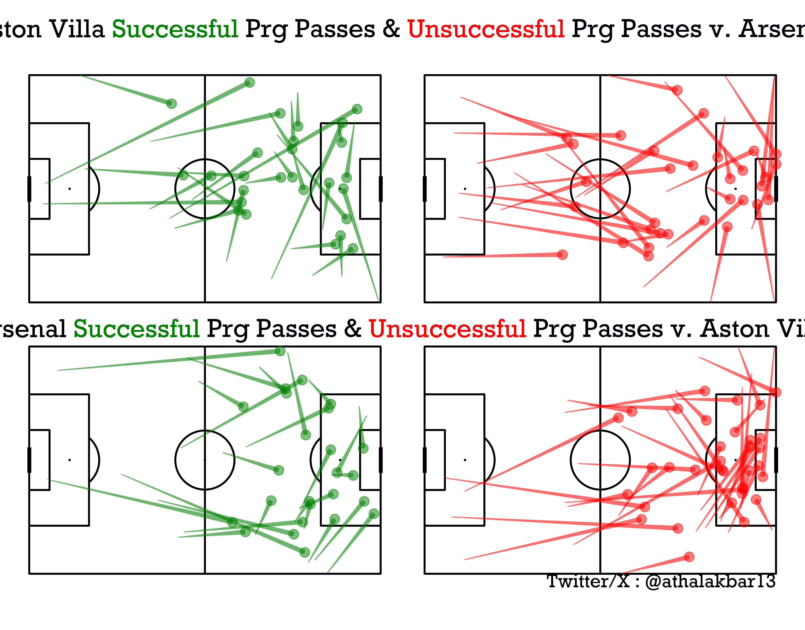

# **Progressive Pass Maps**


Import the SoccerViz Package & Extract the "Pass" Event Data

```py linenums="1"

#Import Extract Module from Library first to scrape data
from SoccerViz import extract

#This is an example URL from Whoscored.com

url = 'https://www.whoscored.com/Matches/1821060/Live/England-Premier-League-2024-2025-Aston-Villa-Arsenal'


#Call the extract functions to get Pass Dataframe,Players Dataframe of the particular match

df = extract.pass_data(url) #df to store extracted pass data
players_df = extract.player_data(url) #df to store player data of the match


#You can find the TEAM Id's of the clubs on their WhoScored page html tags by clicking on the club logos

home_team_id=24 #Aston Villa Team ID
away_team_id=13 #Arsenal Team ID
home_team_name = 'Aston Villa' ## Assign Home Team Name
away_team_name = 'Arsenal'
```

Now Filter and Manipulate the Data using the 'datafilter' function easily

```py linenums="1"
#Filter all the data according to the teams by calling the function into DataFrames(their names are pretty self explanatory)

#You can use and call any dataframe you would like to analyze in raw tables and columns i.e. in a DataFrame form
pass_between_home,pass_between_away, avg_loc_home, avg_loc_away, 
passes_home, passes_away,df_prg_home,df_comp_prg_home,
df_uncomp_prg_home,df_prg_away,df_comp_prg_away,df_uncomp_prg_away = datafilter.analyze_passes(df, players_df, home_team_id, away_team_id)

#All the DF (dataframe) labels are pretty self-explanatory

```

Finally after scrapping and filtering data you are ready to plot your Pass Network Map

```py 
#Call the function and put in home and away team names
plot = plot.prg_passes(df_comp_prg_home, df_uncomp_prg_home, df_comp_prg_away, df_uncomp_prg_away, home_team_name,
                away_team_name)
```

