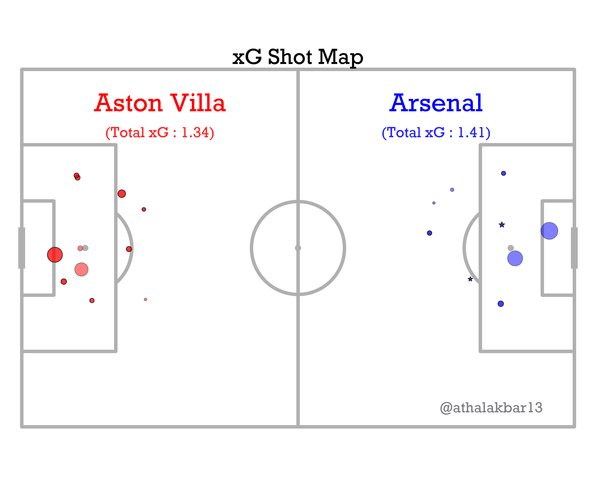

# **Shot Maps**

## What is the benefit of a ShotMap?

-**Visualizes Shooting Patterns**: Displays the location, type, and outcome of shots, helping to identify where a team or player is most effective.

-**Assesses Attacking Efficiency**: Helps analyze how effectively a team or player converts opportunities into goals.

-**Identifies Weaknesses**: Reveals areas where a team or player might struggle to generate quality chances or convert them.

### **Here's how you can plot ShotMaps of ANY game recorded on _[understat.com](https://www.understat.com)_ with a few lines of code**

Import the SoccerViz Package & Extract "Shot" Event Data

```py linenums="1"
from SoccerViz import plot,extract,datafilter

#Example is from the Aston Villa v. Arsenal Game

understat_url = 'https://understat.com/match/26618'  #Copy Link of the Understat URL
home_df,away_df = extract.shots(understat_url)
home_team_name = 'Aston Villa'
away_team_name = 'Arsenal'
```

Now filter the shots into dataframes which you can also call on to analyze in a raw table form

```py
#Filter all the data according to the teams by calling the function into DataFrames(their names are pretty self explanatory)

df1_missed,df2_missed,df1_saved,df2_saved,df1_goal,df2_goal,df1_block,df2_block,totalxG1,totalxG2=datafilter.analyze_shots(home_df,away_df)

```

Now simply call in the function to plot the ShotMap

```py
plot = plot.shot_map(df1_missed, df2_missed, df1_saved, df2_saved, df1_goal, df2_goal, df1_block, df2_block, home_team_name,
             away_team_name,totalxG1, totalxG2)
```


