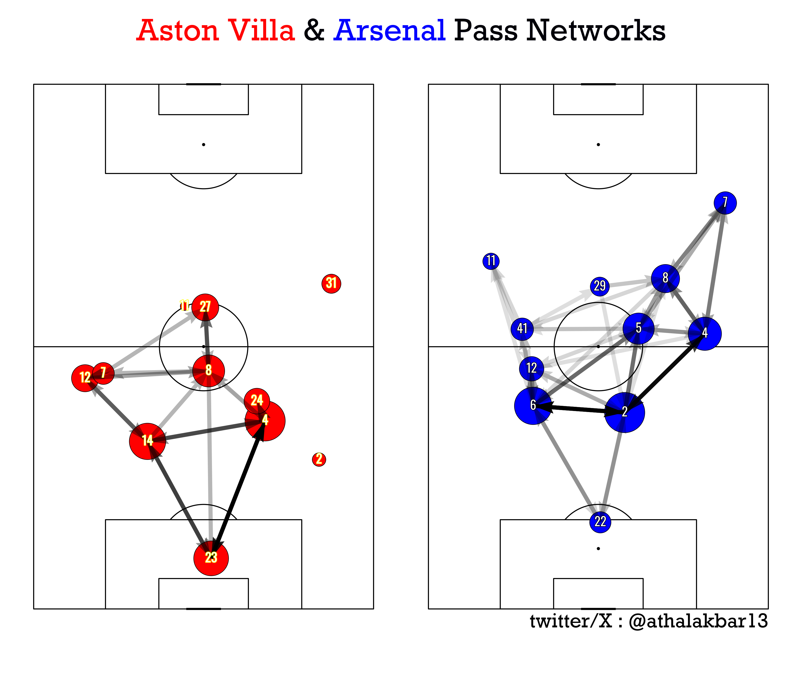

#  **Welcome to SoccerViz**

### SoccerViz is a one-stop open-source Python library capable of extracting,manipulating & plotting data making it easier for soccer fans & analysts to gain insight beyond the goals

## **Quick Start Guide**

Use the package manager [pip](https://pypi.org) to install the package
    
    'pip install SoccerViz'

#### The package has three modules, each of which is attributed it's own functions, these three modules are:

#### - Extract : This module is responsible for extracting data from websites such as WhoScored and Understat granting access to data for users
#### - DataFilter : This module then filters & manipulates data which can be then plotted or simply analyzed by the user
#### - Plot : This module plots the filtered data 

## Example of a PassNetwork plotted through SoccerViz

For full documentation visit [SoccerViz GitHub Repo](https://github.com/athalak13/SoccerViz-Library).

## **Want to help?**

It would be an absolute pleasure to have the users feedback to improve the end product,
& I am always ears to new ideas/features you guys would like me to add.
Please do get in touch with me on my [X](https:///www.x.com/athalakbar13) (formerly Twitter) or [LinkedIn](https://www.linkedin.com/in/muhammad-athal-akbar-204aba21b/)

## **Inspiration & Credits**

[Mckay Johns](https://x.com/mckayjohns)
[MPL-Soccer Dev](https://x.com/mplsoccer_dev)
[David Sumpter](https://x.com/Soccermatics)
[Liam Henshaw](https://x.com/HenshawAnalysis)
[Ben Griffins]()
[Scott Willis](https://x.com/scottjwillis)
[Paddy at Attacking Football](https://x.com/OddsOnFPL)

## **Contents**

- Pass Network Map
- Progressive Pass Maps
- ShotMaps
- Player Comparisons

